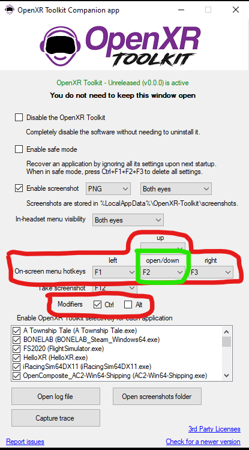
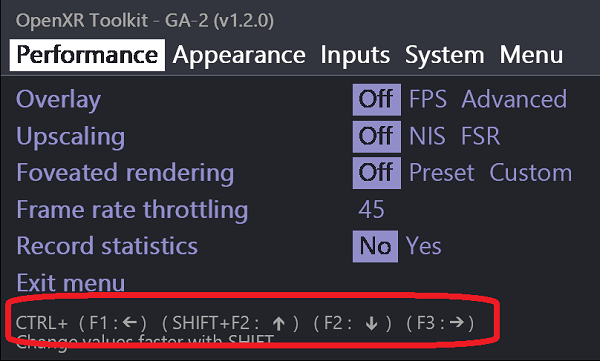

# OpenXR Toolkit

This software provides a collection of useful features to customize and improve existing OpenXR applications, including render upscaling and sharpening, foveated rendering, image post-processing, hand tracking to controller input simulation (on supported devices only) and other game-enhancing tweaks.

For more details on how it works, see the [How does it work?](how-does-it-work).

DISCLAIMER: This software is distributed as-is, without any warranties or conditions of any kind. Use at your own risks.

# Setup

## Downloads

Current version: **1.2.2**

[Download the latest](https://github.com/mbucchia/OpenXR-Toolkit/releases/download/1.2.2/OpenXR-Toolkit-1.2.2.msi){: .btn .btn-blue }

...or expore [all versions](https://github.com/mbucchia/OpenXR-Toolkit/releases).

## Requirements

This software may be used with any brand of VR headset as long as the target application uses DirectX with any GPU compatible with DirectX 11 and above. The application must use OpenXR.

The following headsets have been confirmed to work: Windows Mixed Reality (eg: HP Reverb, Samsung Odyssey), Oculus Quest & Quest 2, Pimax 5K & 8KX, Varjo Aero & VR-3, Valve Index, HTC Vive, HTC Vive Cosmos, Pico Neo 3 & 4.

The following OpenXR ToolKit features have additional restrictions:

+ Fixed Foveated Rendering and Foveated Rendering are only supported with the following GPUs:
  + NVIDIA GeForce GTX 1600 series and RTX series, both DX11 and DX12 applications.
  + AMD RX 6000 series, with DX12 applications only.

+ Foveated Rendering with eye tracking is only supported with the following headsets:
  + Varjo-brand devices.
  + HP G2 Omnicept.
  + Pimax-brand devices with Droolon eye tracking module. 

## Limitations

+ This software may not work with all OpenXR applications. See the [Compatibility](compat) list.
  + It can also be used with certain OpenVR applications through [OpenComposite](opencomposite).
+ If using with a Pimax headset, you may consider using [PimaxXR](https://github.com/mbucchia/Pimax-OpenXR/wiki) as your OpenXR runtime.
+ Fixed and Eye-tracked Foveated Rendering in Microsoft Flight Simulator is incorrectly applied in the main menu, resulting in blurry menu windows.
+ Fixed Foveated Rendering is not supported in IL-2 Sturmovik.
+ OpenXR Toolkit is not compatible with War Thunder on Varjo headsets.
+ OpenXR Toolkit is only compatible with iRacing when using OpenXR. Compatibility going through OpenComposite has not been tested, and will not be officially supported.
+ OpenXR Toolkit is not compatible with ReShade.
+ See the [open bugs](https://github.com/mbucchia/OpenXR-Toolkit/issues?q=is%3Aopen+is%3Aissue+label%3Abug).

## Installation

Video tutorial by [PIE IN THE SKY TOURS](https://www.youtube.com/c/pieintheskytours):

<iframe width="560" height="315" src="https://www.youtube.com/embed/3CW8x9TBeQ0" title="YouTube video player" frameborder="0" allow="accelerometer; autoplay; clipboard-write; encrypted-media; gyroscope; picture-in-picture" allowfullscreen></iframe>

### 1. Run the `OpenXR-Toolkit.msi` program.

> 📝 **Note:** You may be warned that Windows protected your PC because this software is not trusted. The application is built on a GitHub server hosted in the Microsoft cloud, which greatly limits the risk of contamination from viruses and malware. Additionally, we have digitally signed the software through a reputable organization (Comodo) which helps with guaranteeing that is has not been altered by any third party.

  
Proceed through the "Windows protected your PC" warning...

  
Select <i>More info</i> then <i>Run anyway</i>.

  
  

### 2. Follow the instructions to complete the installation procedure.

> 📝 **Note:** You do not need to uninstall the previous version of OpenXR Toolkit if you had one installed. The new version will overwrite the previous one.

### 3. Launch the _OpenXR Toolkit Companion app_ to confirm that the software is active.

  
You can use the shorcut found on the desktop or in the Start menu...

  
  

The _OpenXR Toolkit Companion app_ may be used sporadically to enable or disable advanced features or perform recovery (see further below). The application displays a green or red status indicating whether the software OpenXR component is active.

The _OpenXR Toolkit Companion app_ can also be used to customize the keyboard shortcuts used to invoke and navigate the menu.

> 💡 **Tip:** You don't need to keep the companion app running in order to use the software: the actual settings for the toolkit are available from within your OpenXR application and display directly in the headset! (see below). 

# Basic usage

Once installed, please run the desired OpenXR application. A welcome message will appear and instruct you to open the menu:

> 💡 **Troubleshooting:** Can't see the menu? Head to [Troubleshooting](troubleshooting#menu-is-not-showing) for help.

In order to navigate the menu, select options and change values:

- Use `CTRL+F2` to move to the next option (next line) in the menu.
- Use `CTRL+F1` to move selection to the left / decrease the option value.
- Use `CTRL+F3` to move selection to the right / increase the option value.
- Hold both `SHIFT` and `CTRL` together to change values fasters.

> 💡 **Tip:** Use the _OpenXR Toolkit Companion app_ to change the default shortcut keys.

## Available options

See [Features](features) for more details.

# Recovery

See [Troubleshooting](troubleshooting) for more details.

If changing some settings render the application unusable, use Ctrl+F1+F2+F3 to hard reset all settings.

**Note: if the key combinations were changed from the _OpenXR Toolkit Companion app_, please use the newly assigned keys**.

 If an application can no longer start, use the _OpenXR Toolkit Companion app_ (found on the desktop or Start menu) and select the Safe mode before starting the application, then use Ctrl+F1+F2+F3 (regardless of custom key combinations) to hard reset all settings.

# Removal

The software can be removed from Windows' _Add or remove programs_ menu.

In the list of applications, select _OpenXR-Toolkit_, then click _Uninstall_.

