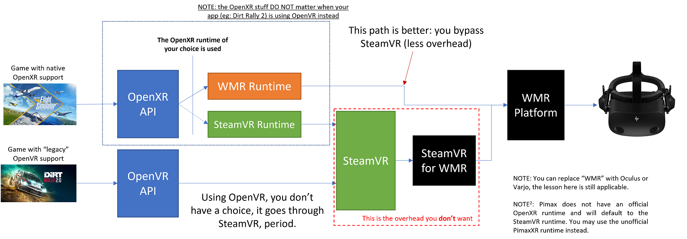
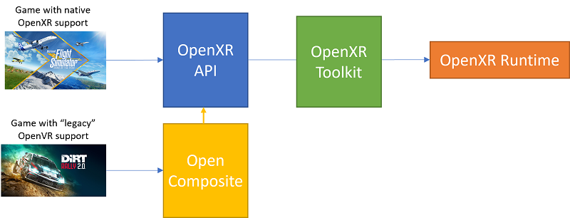
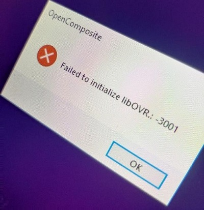
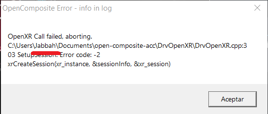
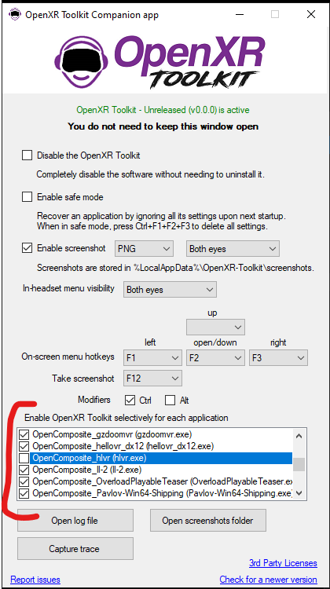

## Table of contents
{: .no_toc .text-delta }

1. TOC
{:toc}

---

## Introduction

The goal of [OpenComposite](https://gitlab.com/znixian/OpenOVR/-/tree/openxr) is to run applications built on the legacy OpenVR (predecessor of OpenXR), which typically require SteamVR, to use OpenXR instead.

The diagram below show how games developed for OpenXR and OpenVR typically operate. This is before the introduction of OpenComposite.

<br>
*Ecosystem before OpenComposite*

The diagram below show how OpenComposite enables applications built for OpenVR to bypass SteamVR and to take advantage of OpenXR.

<br>
*Ecosystem with OpenComposite*

OpenComposite is a separate software from OpenXR Toolkit, developed and maintained by a different team.

The goal of OpenXR Toolkit is to add functionality to OpenXR applications. However, not all applications are written for OpenXR, and therefore OpenXR Toolkit cannot be used with these applications, unless they can use OpenComposite to use OpenXR.

OpenXR Toolkit is not necessary in order to take advantage of OpenComposite to bypass SteamVR. OpenXR Toolkit can be _optionally_ installed to add additional tweaks and performance-improvement features to the games using OpenXR directly or OpenComposite.

<br>
*OpenXR Toolkit with OpenComposite*

For more details on OpenVR, OpenXR, OpenComposite, you may read [An Overview of VR Software Components](https://fredemmott.com/blog/2022/05/29/vr-software-components.html).

### Pimax users

For Pimax users, the story is slightly different. Officially, Pimax does not offer an OpenXR runtime that natively speaks to the Pimax platform software. Instead, Pimax offers support for OpenXR through a SteamVR bridge. Therefore, using OpenXR on Pimax does not allow you to bypass SteamVR.

However, the unofficial project [PimaxXR](https://github.com/mbucchia/Pimax-OpenXR/wiki) implements natively OpenXR for Pimax devices without the need to use SteamVR. This can be used with native OpenXR games (like Flight Simulator 2020) or with OpenComposite to bypass SteamVR entirely. 

## Compatibility

Both OpenComposite and OpenXR Tookit are limited in the applications that they support. Sometimes, combinations of OpenComposite plus OpenXR Toolkit are also not working. The table below tracks known games to work with OpenComposite and whether they also work with OpenXR Toolkit.

**Do not use any version of OpenXR Toolkit older than 1.1.4 with OpenComposite.** Older versions are not compatible.

There is an [official compatibility for OpenComposite](https://docs.google.com/spreadsheets/d/1s2SSuRt0oHm91RUZB-R-ef5BrfOtvP_jwDwb6FuMF9Q/edit#gid=2068512515), and you can also refer to the table below for compatibility with OpenXR Toolkit.

| Game | OpenComposite | OpenXR Toolkit |
| --- | --- | --- |
| American Truck Simulator 2 | Yes | Yes |
| Assetto Corsa | Yes | Yes |
| Assetto Corsa Competizione | Yes | Yes [1] |
| Automobilista 2 | Yes | Yes |
| Digital Combat Simulator | Yes | Yes |
| Dirt Rally 2 | Yes [2] | Yes [2] |
| Elite Dangerous | Yes | Yes |
| Euro Truck Simulator 2 | Yes | Yes |
| IL-2 Sturmovik | Yes | Yes [3] |
| iRacing | Yes | No [4] |
| F1 2022 | Yes | Yes |
| Project Cars 2 | Yes | Yes |
| Project Cars 3 | Yes | Yes |
| rFactor 2 | Yes | Yes |
| Subnautica | Yes | Yes |
| X-Plane 11 | Yes [5] | Yes [3] [6] |
| X-Plane 12 | Yes [5] | Yes [3] [6] |

[1] Supports Eye-tracked Foveated Rendering.

[2] Dirt Rally 2 with the eye accomodation fix requires [dr2vrfix-openxr](https://github.com/mbucchia/dr2vrfix-openxr).

[3] Does not support Fixed Foveated Rendering.

[4] iRacing now has official support for OpenXR, and OpenXR Toolkit is only compatible in that mode, and not with OpenComposite.

[5] On Windows Mixed Reality, X-Plane requires the use of [OpenXR-Vk-D3D12](https://github.com/mbucchia/OpenXR-Vk-D3D12).

[6] X-Plane is only compatible with OpenXR Toolkit on Windows Mixed Reality.

Do you have a game working but it's not in the list? Please file an [Issue](https://github.com/mbucchia/OpenXR-Toolkit/issues) to let us know!

## Tips for using OpenComposite

### Understand the difference between Steam and SteamVR

When using OpenComposite, you will bypass the SteamVR platform that enables your VR content to run. But you will still need to use Steam, the application store. Just because you will start a game from Steam doesn't mean that it will use SteamVR (unless OpenComposite is not correctly set up for this game).

### Understand what the `openvr_api.dll` is

OpenComposite is an implementation of the OpenVR API, which is typically done on the system with the official `openvr_api.dll` system file. With OpenComposite, you are replacing the system implementation of the OpenVR API, hence replacing this `openvr_api.dll` file with the one provided by OpenComposite.

This can be done in two ways:

1) Per-game. You replace the `openvr_api.dll` file in the game folder directly with the one supplied by OpenComposite.

2) System-wide. You use the OpenComposite launcher application to change where all games looks for the `openvr_api.dll` file and make them use the copy supplied by OpenComposite.

### Be sure to grab the OpenXR version of OpenComposite

OpenComposite was originally developed for Oculus. When looking up OpenComposite, you may end up on the GitLab page for the project, which defaults to the "main" branch, which is for Oculus only. Be sure to pick the "openxr" branch.

As shown in the link below, the URL ends with `/tree/openxr`.

[https://gitlab.com/znixian/OpenOVR/-/tree/openxr](https://gitlab.com/znixian/OpenOVR/-/tree/openxr)

To confirm that you landed on the right place, you may look for "openxr" in the list box on the left, as shown below.


If you mistakenly pick the incorrect version, you will get the following error at start up, referring to "LibOVR":



### Don't use the legacy OpenComposite-ACC, aka v0.6.3

Before being officially included in the OpenComposite project, support for OpenXR was implemented in a separate project by developer Jabbah. The name of the project was OpenComposite-ACC.

This project is now defunct and superseded by the official OpenComposite. If you get an error message containing the path to a file in a user "Jabbah" folder, then you are using the deprecated version, and you must immediately switch to the newer, [official OpenComposite](https://gitlab.com/znixian/OpenOVR/-/tree/openxr).



### Don't install/use the Windows Mixed Reality (WMR) Portal and/or Tools if you don't have a WMR device

Many tutorials out there focus on setting up OpenComposite for Windows Mixed Reality (WMR). This is a specific category of headsets, like HP Reverb brand.

If your headset is of Oculus, Varjo, or Pimax branch, don't bother with the WMR stuff!

### Don't set up everything at once!

Before even considering the use of OpenXR Toolkit, test the application with just OpenComposite. If the application does not work with OpenComposite only, there is no point in adding OpenXR Toolkit in the mix. You must first get the application to work with OpenComposite, then try to enable OpenXR Toolkit.

You may use the  _OpenXR Toolkit Companion app_ (found on the desktop or Start menu) to disable the OpenXR Toolkit system-wide (1st checkbox near the top) or just for that application. **Note that an application will only show up in the list after it is run at least once.**



### Disable all other mods: ReShade, vrperfkit, openvr_fsr...

A lot of mods don't play well together. Before installing OpenComposite, be sure to disable them. You may run a repair of the game from Steam to do that and restore your original game DLLs.

### The game will not start with error "unknown config option"

Don't use a stale `opencomposite.ini` configuration file (from an older version of OpenComposite for example).


There are several tutorials online referencing the older OpenComposite-ACC project (see above), which supported different options than the newer OpenComposite. If you are getting errors mentioning unknown config options, try deleting the `opencomposite.ini` file in the application folder.

### The image and/or OpenXR Toolkit menu is upside down

This can happen with certain buggy versions of OpenXR Toolkit or certain OpenXR runtimes.

Create an `opencomposite.ini` file in the folder of the game, and add the following line to it:

```
invertUsingShaders=true
```

Make sure that the file extension is `.ini` and not `.ini.txt`!

### More OpenXR Toolkit troubleshooting

See [Troubleshooting](troubleshooting) for more details about OpenXR Toolkit troubleshooting.
