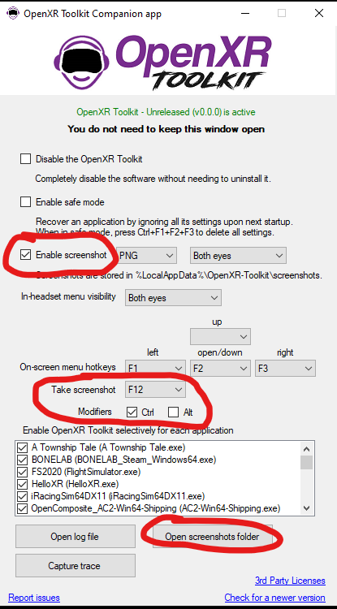

## Table of contents
{: .no_toc .text-delta }

1. TOC
{:toc}

---

## World scale override

The world scale override can be used to change the relative position of the eye cameras (also known as the Inter-Camera Distance, or ICD). This can affect your perception of the size of the world in VR. Reducing the scale (ie: a scale under 100%) will make the world appear smaller, while increasing the scale (ie: a scale above 100%) will make the world appear bigger.

## Shaking reduction

**Note:** This setting is currently not available to Varjo users due to a bug in the Varjo software.

Previously known as "prediction dampening" this setting allows to reduce the jitter that can be observed when head or controller is predicted "too long in advance". This often manifests as "over-sensitivity" with your head movements. For example, some people have reported the view in the headset shaking with their heartbeats. That is an example of over-sensitivity. Set a negative value to reduce the amount of prediction and reduce shaking, for example -50% will cut in half the requested amount of prediction. Experimentally, best results have been achieved with values between -20% and -40%.

## Brightness, contrast and saturation

The OpenXR Toolkit applies some simple post-processing to adjust the brightness, contrast and saturation of the images displayed in the headset. The way these settings affect the image is comparable to the settings found on your TV or computer monitor. They are applied on the rendered images as a whole, and are subject to limitations due to color encoding.

Each setting has a default value of 50, which means no changes to the game's output. The saturation adjustments can be applied to all 3 color channels (red, green, blue) or individually for each channel.

## Lock motion reprojection

**Note:** This setting is only available to Windows Mixed Reality users.

When motion reprojection is enabled via the [OpenXR Tools for Windows Mixed Reality](https://www.microsoft.com/en-us/p/openxr-tools-for-windows-mixed-reality/9n5cvvl23qbt), this setting can be used to force the motion reprojection rate, rather than let the OpenXR runtime automatically choose the rate based on the current performance. This is useful if you are experiencing large fluctuations in frame rate, and prefer to lock the frame rate to a smaller (but steadier) value. The motion reprojection rate is a fraction of the headset's refresh rate, for example with 90 Hz refresh rate, the available rates are 1/half (45 FPS), 1/third (30 FPS) and 1/quarter (22.5 FPS).

When motion reprojection is not enabled, this setting has no effect.

## Frame rate throttling.

This option can be used to throttle down the frame rate of the application and avoid fluctuations in frame rates. This option may introduce unwanted latency, since the locked frame rate might not properly phase with the scan-out of the headset.

This option will not appear for Windows Mixed Reality users if the _Motion Reprojection_ is forced to _On_ in the _System tab_. You must use the _Lock motion reprojection_ instead (see above). This is because the Motion Reprojection rate locking is preferred, since it is latency-aware and produces better results.

## Field of view

The field of view override adjusts the pixel density per degree. A smaller field of view is covering a smaller region of the view but with the same amount of pixels, effectively increasing the perceived resolution. Two levels of controls are available: simple and advanced. The former adjusts the fied of view for both eyes simulatneously, while the latter offers individual controls per-eye.

## Screen capture

In order to activate this feature, you must check the _Enable screenshot_ box in the _OpenXR Toolkit Companion app_, and select an image format for the screenshots. The OpenXR ToolKit supports the following formats: [DDS](https://en.wikipedia.org/wiki/DirectDraw_Surface)*, [PNG](https://en.wikipedia.org/wiki/Portable_Network_Graphics), [JPG](https://en.wikipedia.org/wiki/JPEG) and [BMP](https://en.wikipedia.org/wiki/BMP_file_format). 

You may then press `Ctrl+F12` to take a screenshot of the left-eye image view. Screenshots are saved under `%LocalAppData%\OpenXR-Toolkit\screenshots`. This folder may be opened from the _OpenXR Toolkit Companion app_ by clicking the _Open screenshots folder_ button.

 
*Enabling and accessing screenshots*

**The DDS format is a lossless format native to DirectX but some tools might have issues opening DDS files. The tools that were confirmed to properly open them with the OpenXR Toolkit are [GIMP](https://www.gimp.org/) and [Paint.net](https://github.com/paintdotnet/release/releases)*

## Record statistics

This option can be enable to continuously record some statistics from the application to a comma-separated values (CSV) file stored under `%LocalAppData%\OpenXR-Toolkit\stats`.

When this option is toggled from off to on, a new file is created, with a file name including the date/time (eg: `stats_20220822_183013.csv` for a recording on August 22nd, 2022 at 18:30:13).

The CSV file contains rows with the average FPS, frame times, and VRAM utilization over one second. Every second, a new row is appended.
